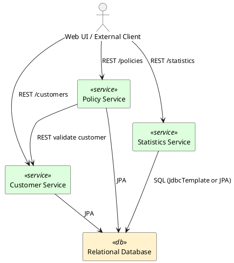

# Target Architecture – Java Microservices for COBOL `cics-genapp` Migration

This document describes the target Java microservices architecture used to migrate the COBOL/CICS insurance sample application (`cics-genapp`) into a Spring Boot–based, domain‑oriented microservices system.

It is driven by the user stories in `docs/stories.md` and by the COBOL components:

- Policy DB programs (`lg*PDB*`)
- Customer DB programs (`lg*CDB*`)
- Statistics programs (`lg*STAT*`, `lgSTS*`)
- Web front-end (`lgwebst5.cbl`)
- Common copybooks (`lgcmarea.cpy`, `lgpolicy.cpy`, `soa*`)

---

## 1. Overview

### 1.1 Domain decomposition

The legacy system’s logical domains are preserved as microservices:

1. **Customer Service**
   - Bounded context: customer master data.
   - Responsibilities:
     - CRUD operations for customers.
     - Validation of customer data.
   - Origin in COBOL:
     - `lgicdb..`, `lgacdb..`, `lgucdb..` programs and customer‑related copybooks.

2. **Policy Service**
   - Bounded context: insurance policy lifecycle.
   - Responsibilities:
     - CRUD operations for policies.
     - Business rules: date validation, linkage to customers, premium rules.
   - Origin in COBOL:
     - `lgipdb..`, `lgapdb..`, `lgupdb..`, `lgdpdb..` programs, `lgpolicy.cpy`.

3. **Statistics Service**
   - Bounded context: reporting/aggregations.
   - Responsibilities:
     - Aggregated counts and sums (by product, status, region, etc.).
   - Origin in COBOL:
     - `lgastat1.cbl`, `lgstsq.cbl` and related copybooks.

4. **Admin/Setup capabilities**
   - Realized as admin endpoints within the above services (rather than a separate service).
   - Responsibilities:
     - Initial data load and reset for test environments.
   - Origin in COBOL:
     - `lgsetup.cbl`, `lgtest*` programs.

5. **(Optional) API Gateway**
   - Optional edge service for UI integration.
   - Responsibilities:
     - Single entry point (e.g. `/api/*`) to underlying microservices.
     - Cross-cutting concerns (auth, rate limiting).

---

## 2. Technology Stack

Per microservice:

- **Language**: Java 17+
- **Framework**: Spring Boot 3.x
  - `spring-boot-starter-web`
  - `spring-boot-starter-data-jpa`
  - `spring-boot-starter-validation`
- **Database**: Relational DB (e.g. PostgreSQL or MySQL)
  - Customer & Policy entities stored in RDBMS instead of VSAM.
- **Build**: Maven multi-module project
- **API Documentation**: springdoc OpenAPI (optional, recommended)
- **Testing**: JUnit 5 + Spring Boot Test
- **Packaging**: Docker (optional)

Parent layout:

```text
Cobol_migrated/
  pom.xml                   # parent POM
  customer-service/
  policy-service/
  statistics-service/
  docs/
    stories.md
    architecture.md
```

---

## 3. Logical Architecture

### 3.1 Microservice responsibilities & APIs

#### Customer Service

- **Responsibilities**
  - Manage customer lifecycle (create, read, update).
  - Enforce basic validations (required fields, formats).
  - Expose customer data for the Policy Service and UIs.

- **REST API**
  - `POST /customers` – create customer.
  - `GET /customers/{id}` – retrieve by internal ID.
  - `GET /customers/by-external-id/{externalId}` – retrieve by COBOL-style ID.
  - `PUT /customers/{id}` – update customer.
  - `GET /customers` – optional search/list with filters.

- **Key Domain Model (simplified)**

  ```sql
  CUSTOMER (
    id             BIGINT PRIMARY KEY,
    external_id    VARCHAR(20) UNIQUE NOT NULL,  -- COBOL ID
    first_name     VARCHAR(50),
    last_name      VARCHAR(50),
    address_line1  VARCHAR(100),
    address_line2  VARCHAR(100),
    city           VARCHAR(50),
    state          VARCHAR(50),
    postal_code    VARCHAR(20),
    country        VARCHAR(50),
    email          VARCHAR(100),
    phone          VARCHAR(30),
    created_at     TIMESTAMP NOT NULL,
    updated_at     TIMESTAMP NOT NULL
  );
  ```

#### Policy Service

- **Responsibilities**
  - Create, read, update, and cancel policies.
  - Validate:
    - Effective/expiry dates.
    - Customer existence (via Customer Service).
    - Premium constraints (non‑negative, etc.).
  - Implement search by key fields.

- **REST API**
  - `POST /policies` – create policy.
  - `GET /policies/{policyNumber}` – retrieve by policy number.
  - `GET /policies?customerExternalId=...` – retrieve policies by customer.
  - `PUT /policies/{policyNumber}` – update policy details.
  - `DELETE /policies/{policyNumber}` – cancel a policy.
  - Future: extended search query parameters (status, productCode, date range).

- **Key Domain Model (simplified)**

  ```sql
  POLICY (
    id               BIGINT PRIMARY KEY,
    policy_number    VARCHAR(20) UNIQUE NOT NULL,
    customer_ext_id  VARCHAR(20) NOT NULL,  -- references CUSTOMER.external_id
    product_code     VARCHAR(10) NOT NULL,
    status           VARCHAR(20),           -- ACTIVE, CANCELLED, LAPSED, etc.
    effective_date   DATE,
    expiry_date      DATE,
    premium_amount   DECIMAL(12,2),
    payment_freq     VARCHAR(20),           -- MONTHLY, ANNUAL, etc.
    region_code      VARCHAR(10),
    created_at       TIMESTAMP NOT NULL,
    updated_at       TIMESTAMP NOT NULL
  );
  ```

- **Inter-service dependency**
  - Policy Service invokes Customer Service (synchronously via REST) when required to:
    - Validate that a given `customerExternalId` exists.
  - For a simpler first migration, you can rely on DB constraints and later introduce cross-service validation.

#### Statistics Service

- **Responsibilities**
  - Provide aggregated views over policy/customer data:
    - counts and total premiums by product.
    - counts and total premiums by region.
  - Read-only service (no writes to base tables).

- **REST API**
  - `GET /statistics/by-product`
    - Returns list of `{ productCode, count, totalPremium }`.
  - `GET /statistics/by-region`
    - Returns list of `{ regionCode, count, totalPremium }`.
  - `GET /statistics/summary` (optional)
    - Combined summary.

- **Data Access**
  - Reads from the POLICY table via:
    - direct DB access (shared schema), or
    - dedicated reporting schema.
  - In a more advanced setup, you could build a separate reporting DB populated from events; initial version can directly query the same DB.

---

## 4. Architecture Diagrams

### 4.1 Context Diagram (C4 Level 1 – textual)

```text
+-------------------------------+
|           Web UI              |
|  (or external client/system)  |
+---------------+---------------+
                |
                | HTTP/REST
                v
        +-------+--------+
        |   API Gateway  |  (optional)
        +-------+--------+
                |
      +---------+---------+-------------------+
      |         |         |                   |
      v         v         v                   v
+-----+----+ +--+---------+--+           +----+--------------+
|Customer | | Policy       |           | Statistics        |
|Service  | | Service      |           | Service           |
+---------+ +--------------+           +-------------------+
    |             |                          |
    | JPA         | JPA                      | JDBC/JPA
    v             v                          v
+----------------------------- Shared Database -----------------------------+
|  CUSTOMER table                 POLICY table                               |
+-------------------------------------------------------------------------+
```

### 4.2 Container Diagram (PlantUML)

You can paste this into a `*.puml` file if you want graphical diagrams:



---

## 5. Mapping COBOL Structures to Java

### 5.1 `lgpolicy.cpy` → Policy entity/DTO

- COBOL policy layout is mapped to:
  - `Policy` JPA entity (database schema).
  - `PolicyDto` for REST payloads.
- Key fields:
  - COBOL: policy number, customer ID, product type, dates, premium, status.
  - Java: `policyNumber`, `customerExternalId`, `productCode`, `effectiveDate`, `expiryDate`, `premiumAmount`, `status`, `paymentFrequency`, `regionCode`, etc.

### 5.2 `lgcmarea.cpy` → Cobol-style response envelope

Define a generic envelope for REST responses to preserve the COBOL “commarea” semantics:

```java
public class CobolStyleResponse<T> {
    private String statusCode;    // e.g. "OK", "NOTFOUND", "VALIDATION_ERROR"
    private String statusMessage; // user-friendly description
    private T payload;
    // getters/setters
}
```

Controllers wrap domain DTOs in this envelope and set codes based on success/failure, mimicking COBOL status fields.

### 5.3 `soa*` copybooks → External API schemas

If you need external integration to adhere closely to the COBOL-era web service payloads:

- Create DTOs such as `PolicySoaRequest`, `PolicySoaResponse`, `CustomerSoaRequest`, etc., matching the `soa*` copybooks.
- Expose dedicated endpoints like `/soa/policy` that accept and return these DTOs, acting as a compatibility layer for any legacy integrations.

---

## 6. Implementation View (Mapping to Code)

This architecture is implemented via a Maven multi-module project:

### 6.1 Parent POM

- `Cobol_migrated/pom.xml` defines:
  - `groupId`: `com.example`
  - `artifactId`: `cobol-migrated`
  - Packaging: `pom`
  - Modules:
    - `customer-service`
    - `policy-service`
    - `statistics-service`
  - Dependency management: `spring-boot-dependencies`.

### 6.2 Customer Service

Package example: `com.example.customer`

- `CustomerServiceApplication` – Spring Boot main class.
- `domain.Customer` – JPA entity (fields derived from COBOL customer layout).
- `repository.CustomerRepository` – Spring Data JPA repository.
- `web.dto.CustomerDto` – REST DTO.
- `service.CustomerService` – business logic, mapping DTOs ↔ entity.
- `web.CustomerController` – REST controller for `/customers`.

### 6.3 Policy Service

Package example: `com.example.policy`

- `PolicyServiceApplication` – Spring Boot main class.
- `domain.Policy` – JPA entity.
- `repository.PolicyRepository` – JPA repository.
- `web.dto.PolicyDto` – REST DTO.
- `service.PolicyService` – business logic including validations, cancel logic.
- `web.PolicyController` – REST controller for `/policies`.

### 6.4 Statistics Service

Package example: `com.example.statistics`

- `StatisticsServiceApplication` – main class.
- `service.StatisticsService` – uses `JdbcTemplate` or JPA to query aggregates.
- `web.StatisticsController` – REST endpoints under `/statistics`.

---

## 7. Cross-cutting Concerns

### 7.1 Error Handling & Status Codes

- Use `@ControllerAdvice` to:
  - Convert `NoSuchElementException` → `NOTFOUND` in `CobolStyleResponse`.
  - Convert `IllegalArgumentException` (validation errors) → `VALIDATION_ERROR`.
- This preserves the original COBOL pattern:
  - status code + message + data.

### 7.2 Configuration

Each service has `application.yml` with:

- DB connection.
- Server port (e.g. 8081 for customer, 8082 for policy, 8083 for statistics).
- JPA settings (`ddl-auto=update` for development).

Example snippet:

```yaml
spring:
  datasource:
    url: jdbc:postgresql://localhost:5432/cobol_migrated
    username: cobol
    password: cobol
  jpa:
    hibernate:
      ddl-auto: update
    show-sql: true
server:
  port: 8082  # policy-service; others use 8081, 8083
```

### 7.3 Security (future)

- Can be added via `spring-boot-starter-security` and JWT/OAuth2`.
- Not required for initial migration; focus first on functional parity.

---

## 8. Unclear or Non-Directly Implementable Areas

From the COBOL side, certain aspects are not 1:1:

- Exact **screen flows** (`ssmap.bms`, `lgwebst5.cbl`) are not reproduced; instead, we expose REST APIs. A separate web UI must be designed.
- **Test drivers** (`lgtest*`) are replaced by:
  - JUnit tests in each service.
  - Optional REST-based test scripts.
- Any **CICS-specific transaction context** is mapped to standard HTTP request/response and Spring-managed transactions.

These gaps are intentional in moving to a modern microservices architecture and should be filled by new UI and test tooling rather than forced 1:1 emulation of CICS behavior.

---

## 9. Next Steps

1. Align entities/DTOs with the detailed COBOL copybooks (`lgpolicy.cpy`, `lgcmarea.cpy`, customer copybooks).
2. Implement the skeleton code already outlined in the repo:
   - Create the modules.
   - Paste the sample Spring Boot classes and extend them with all fields.
3. Add integration tests that:
   - Create customers and policies.
   - Verify statistics endpoints behave like COBOL stats programs.
4. Optionally introduce:
   - API gateway and UI.
   - More sophisticated error code mapping identical to COBOL status codes.

This architecture ensures a clean, domain-driven migration from COBOL programs and VSAM data to a modern, Spring Boot-based microservices landscape.
